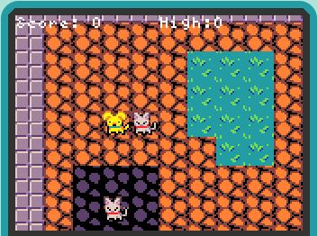
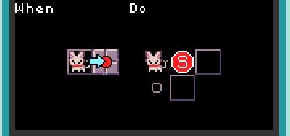
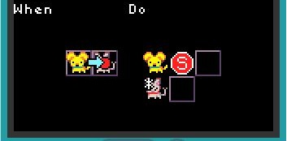
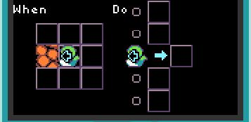

## Patterns of Game Play

A game is composed of various [game mechanics](mechanics). Below you'll find
a variety of different mechanics that you can use as a starting point for 
developing your own game.

## Player Movement

The player sprite typically is controlled using the four-way direction pad (dpad).
Here is a tile map where the player sprite is a dog and four types of tile
backgrounds are visible (grey wall, orange sand, blue/green grass, and dark grey sand):

If we want the user to be able to move the dog only on the orange sand, we can use the following rule:

With this rule, the dog will not be able to move onto any other tile than orange sand.  If we want the dog to be able to move anywhere except the wall, then we can use the following rule instead:

Here's how you change the first rule to the second rule:

## Dog Pushes Cat

In games like Boulder Dash and Sokoban, the player sprite can push another object. Here is a rule that allows the player's dog to push a cat around by sending a move right command to both the dog and cat when the cat is immediately to the right of the dog (and the dpad-right button is pressed):

Create a tile map with several cats and try pushing them around:

Notice that you can push a cat anywhere, including onto another cat or onto a wall.  We create a rule to stop the cat from moving if it is going to smash into the wall:

Make sure to generalize the rule to all four directions! You can create a separate smash rule to prevent a cat from smashing into a cat as well:

 These two rules will prevent a cat from being pushed onto a wall or onto another cat but will still allow the dog to move on top of a cat.  If you don't want that to happen, then you need add another smash rule to stop the dog moving if it is going to smash into a cat:

## Non-Player Character Movement

Many games have characters that move of their own accord. Let's put some snakes in a pond and have the snakes move back and forth: 

We will use the change quadrant in the rule selector screen to code four rules for the snake sprite, starting with the snake at rest:

When the snake is at rest it will move to the left:

If the snake has just moved left and there is water to the left of the snake, it will move left:

If the snake has just moved left and there is sand to the left of the snake, it will move right:

If the snake has just moved right and there is water to the right of the snake, it will move right:

## Painting Tiles

## Projectile Movement

Many games allow a player to shoot a projectile in a given direction.

